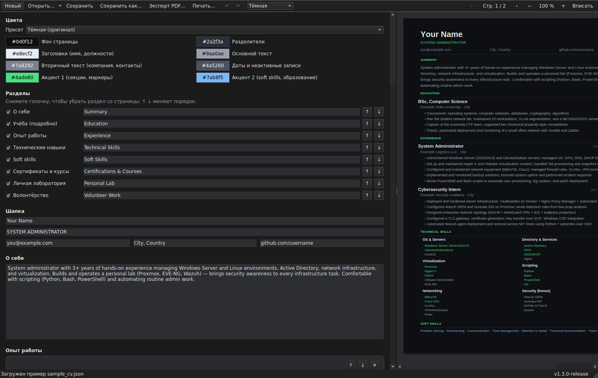
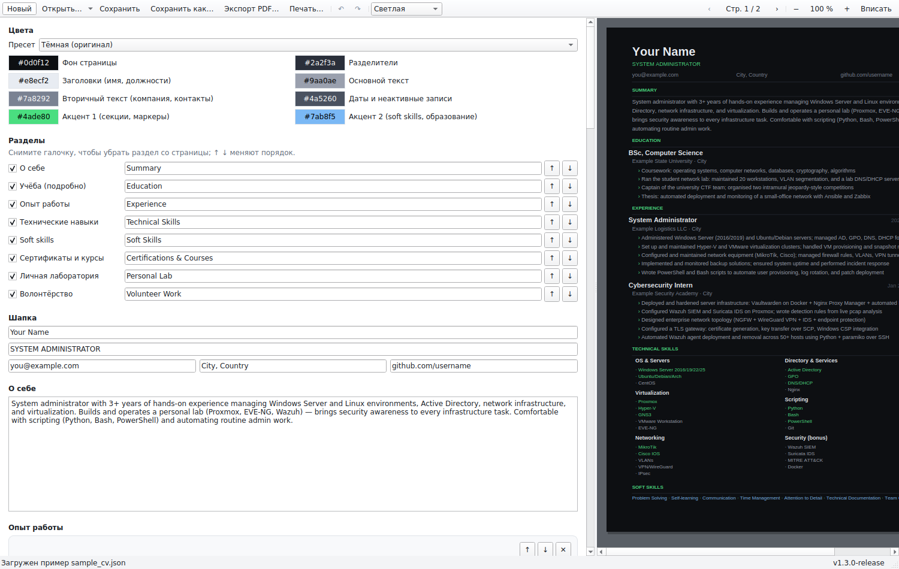

# CV Builder

Десктопное приложение: слева форма редактирования резюме, справа живой
предпросмотр, на выходе — A4-PDF по тёмному шаблону. Данные хранятся в JSON,
так что можно держать несколько версий резюме.

Ядро на C++17 без внешних зависимостей: свой парсер JSON, свой парсер и
сабсеттер TrueType, свой движок раскладки, свой генератор PDF. Ни одна из этих
частей не знает ни про операционную систему, ни про интерфейс.

## Платформы

| | Интерфейс | Состояние |
| --- | --- | --- |
| Windows 10/11 | Win32 + Direct2D (`CVBuilder.exe`) | эталонная реализация, собирается и проверена |
| Windows 10/11 | Qt Widgets (`CVBuilder-Qt.exe`) | собирается там, где есть Qt 6; на этой машине не проверялась |
| Linux x86-64 | Qt Widgets | собирается, запускается, тесты проходят; есть `.tar.gz` и отдельный `cvcli` |
| macOS | Qt Widgets | код есть, но на Mac не собиралась — см. «Что осталось» |
| любая | `cvcli` — рендер JSON → PDF без окна | собирается и проверена на Windows и Linux |

Windows-версия на Win32 не удалена и не заморожена «на всякий случай»: она
остаётся эталоном, с которым сверяется переносимая. Обе собираются из одного
ядра, и в этом смысл — **PDF, собранный на Windows и на Linux, побайтово один и
тот же файл** (проверяется тестом, см. «Шрифт и одинаковый PDF»).

Подробный разбор архитектуры и переноса — в
[`CROSS_PLATFORM_ANALYSIS.md`](CROSS_PLATFORM_ANALYSIS.md).

## Как это выглядит

Переносимая версия, тёмная и светлая палитра — слева форма, справа страница A4:





Снимки сделаны без дисплея, самой программой:

```bash
QT_QPA_PLATFORM=offscreen build/linux/bin/resume_qt_shot out.png dark [resume.json]
```

Это же удобно приложить к сообщению об ошибке: видно и интерфейс, и то, как
программа разметила конкретное резюме.

## Возможности

- Редактируются все секции шаблона: шапка и контакты, «о себе», опыт работы
  (должности с пунктами), технические навыки (группы в две колонки, у каждого
  навыка флаг выделения), soft skills, образование и сертификации,
  волонтёрство, личная лаборатория.
- Полный контроль цвета: 8 ролей (фон, разделители, заголовки, текст,
  вторичный текст, приглушённый текст, акцент 1, акцент 2) через системный
  color picker, плюс 5 готовых пресетов. Палитра хранится вместе с резюме.
- Добавление, удаление и перестановка работ, пунктов, навыков, групп и записей.
- Настраиваемый состав документа: любой раздел можно переименовать, отключить
  или подвинуть вверх-вниз в блоке «Разделы». Порядок хранится в резюме
  (ключ `sections`); файлы без него читаются как раньше и получают порядок по
  умолчанию.
- Живой предпросмотр с зумом 50–300 % и навигацией по страницам; перенос на
  вторую страницу происходит автоматически.
- Сохранение и загрузка JSON (`Ctrl+S` / `Ctrl+O`), экспорт PDF (`Ctrl+E`) —
  готовый файл сразу открывается в системном просмотрщике.
- Файл резюме можно просто перетащить на окно — он откроется так же, как
  через `Ctrl+O`, с тем же вопросом о несохранённых изменениях. Если
  перетащить несколько файлов, откроется первый, а в строке состояния будет
  сказано, сколько их было.
- Светлая и тёмная темы интерфейса. Список на панели переключает между «Как в
  системе», «Светлая» и «Тёмная»; в первом режиме окно следует системной
  настройке и перекрашивается сразу, как её меняют. Выбор запоминается там, где
  система хранит такие вещи: в реестре под `HKCU\Software\CV Builder` на
  Windows, в `settings.ini` под XDG-каталогом на Linux, в
  `~/Library/Preferences` на macOS. Палитра одна и та же на всех платформах и
  задана в `src/uicommon/palette.cpp`. Тёмное оформление контролов в Win32-версии
  требует Windows 10 1809 или новее.
- Полная поддержка кириллицы: шрифт внедряется в PDF подмножеством — вместе с
  картой ToUnicode, поэтому из PDF корректно копируется текст.
- Восстановление после сбоя: пока есть несохранённые изменения, раз в полминуты
  пишется снимок; если сеанс закончился аварийно, при следующем запуске
  предлагается его восстановить. Снимок старше файла, из которого он сделан,
  считается устаревшим и удаляется, а не предлагается.

## Шрифт и одинаковый PDF

Переносы строк в шаблоне — функция ширин символов того шрифта, которым резюме
размечено. Если шрифт выбирает система, PDF на Windows, Linux и macOS будет
тремя разными файлами, а резюме, размеченное в одной версии программы, «поедет»
в другой. Поэтому шрифт лежит в репозитории (`assets/fonts`, Liberation Sans под
SIL OFL 1.1) и пробуется первым на всех платформах; системные шрифты остаются
только резервом.

Liberation Sans выбран не по репутации «метрически совместимого с Arial», а по
измерению: ширины всех 918 кодовых точек, которые может поставить шаблон,
совпадают с Arial, и раскладка `sample_cv.json` совпадает с прежней
Windows-версией байт в байт. DejaVu Sans, для сравнения, расходится в 896
точках из 918 и даёт шесть лишних строк переноса. Подробности и способ повторить
измерение — в [`assets/fonts/README.md`](assets/fonts/README.md).

Отсюда два следствия: существующие резюме размечаются как раньше, и PDF на разных
системах — один и тот же файл. Второе проверяется тестом, который сравнивает
готовый PDF с закреплённой контрольной суммой; она измерена на Windows и на
Linux и совпадает.

## Сборка

Сборка описана одним CMake для всех платформ; какие файлы платформенные,
решает build system, а не препроцессор. Готовые конфигурации лежат в
`CMakePresets.json`:

| Пресет | Что собирает |
| --- | --- |
| `windows-mingw` | Windows, кросс-компиляция mingw-w64 (из WSL или любого Linux) |
| `windows-msvc` | Windows, Visual Studio 2022 |
| `linux` | Linux, системный компилятор |
| `macos` | macOS, системный компилятор |

Привычный путь под Windows — кросс-компиляция из WSL. Разово поставить
тулчейн:

```bash
wsl -d Ubuntu -- sudo apt install -y g++-mingw-w64-x86-64 cmake make
```

Дальше из корня проекта:

```powershell
.\build.ps1
```

Результат — `build\windows-mingw\bin\CVBuilder.exe`; скрипт заодно прогоняет
тесты ядра. `.\run.ps1` пересоберёт при необходимости и запустит.

Вручную, на любой платформе:

```bash
cmake --preset linux            # или windows-mingw / windows-msvc / macos
cmake --build build/linux -j
ctest --preset linux            # тесты; графический интерфейс не нужен
```

Qt 6 (модули Core, Gui, Widgets, PrintSupport, версия 6.4 или новее — то есть то,
что есть в Ubuntu 24.04 LTS и Debian 13; проверялось на 6.4.3, 6.8.3 и 6.10.2)
нужен только
для переносимого интерфейса. Если его нет, CMake скажет об этом и соберёт всё
остальное — ядро, `cvcli`, тесты и, на Windows, Win32-версию:

```bash
sudo apt install -y qt6-base-dev                 # Debian/Ubuntu
brew install qt                                  # macOS
cmake --preset linux -DCMAKE_PREFIX_PATH=/path/to/Qt/6.8.3/gcc_64   # или так
cmake --preset linux -DCVB_BUILD_QT_UI=OFF       # или вовсе без него
```

Цели соответствуют слоям программы, поэтому ошибка линковки — это сообщение
сборки о том, что нарушено разделение слоёв:

| Цель | Содержимое |
| --- | --- |
| `resume_core` | модель, раскладка, TrueType, PDF, JSON — без ОС и без UI |
| `resume_render` | один обход страницы для всех бэкендов, кроме PDF |
| `resume_platform` | каталоги, настройки, поиск шрифтов, аргументы — по одной реализации на ОС |
| `resume_app` | что одинаково везде: список недавних файлов, автосохранение, выбор шрифта |
| `resume_uicommon` | палитра и подписи, общие для двух фронтендов |
| `resume_ui_win32` | исходный фронтенд на Win32 + Direct2D (только Windows) |
| `resume_ui_qt` | переносимый фронтенд на Qt Widgets |
| `CVBuilder`, `CVBuilder-Qt` | приложения |
| `cvcli` | консольный рендерер |
| `resume_tests`, `resume_qt_tests` | тесты ядра и рендера предпросмотра |

В `src/core` и `src/render` не должно появляться ни `windows.h`, ни `d2d1.h`, ни
`#ifdef _WIN32` — платформенный выбор живёт в CMake. Это стоит проверять при
ревью: `grep -r "windows.h\|_WIN32" src/core src/render` должен молчать.

## Установщик

`installer\setup.iss` собирает обычный установщик Windows — с ярлыками,
записью в «Установка и удаление программ» и деинсталлятором. Нужен Inno
Setup 6, разово:

```powershell
winget install JRSoftware.InnoSetup
```

Дальше:

```powershell
.\build.ps1 -Installer
```

Сначала соберутся исполняемые файлы, потом из них —
`build\CVBuilder-2.0.0-setup.exe`. По умолчанию установщик не просит прав
администратора и ставит программу в `%LOCALAPPDATA%`; на первом шаге можно
переключиться на установку для всех пользователей в `Program Files`. Внутрь
кладутся оба исполняемых файла, `sample_cv.json`, README, лицензия и
`assets\fonts` — шрифт обязателен, без него программа падает на системный и PDF
перестаёт быть тем же файлом, что на других системах. Приложение читает пример
только при старте и никогда в него не пишет, поэтому установка в `Program Files`
ничему не мешает: «Сохранить» для нового резюме всегда открывает диалог.

## Артефакты для Linux

```bash
tools/release-linux.sh
```

Собирает, прогоняет тесты и кладёт в `releases/`:

| Файл | Что это |
| --- | --- |
| `CVBuilder-<версия>-linux-x86_64.tar.gz` | редактор, `cvcli`, шрифт, пример, `INSTALL.txt` |
| `cvcli-<версия>-linux-x86_64` | только консольный рендерер, одним файлом |

Требования скрипт не выдумывает, а вычитывает из собранных файлов и пишет в
`INSTALL.txt`: сейчас это `GLIBC_2.34` и `GLIBCXX_3.4.29`, то есть Ubuntu 22.04 и
Debian 12 и новее. Редактору дополнительно нужен Qt 6.4+ из системы.

Важное про переносимость: насколько старую систему потянет бинарник, решает
возраст машины, на которой он собран, а не флаги компоновщика. Статическая
линковка libstdc++ была проверена и делает **хуже** — требование поднимается до
`GLIBC_2.38`. Чтобы поддержать более старые дистрибутивы, собирать нужно на них
же — например, в контейнере на базе Ubuntu 22.04. То же относится и к AppImage:
он упаковывает Qt, но никогда не упаковывает glibc.

Установщик ничего не тянет за собой — исполняемые файлы слинкованы
статически, так что установка сводится к копированию файлов.

Версия задаётся в одном месте — `res\version.h`. Оттуда её берут оба `.rc`,
а `setup.iss` вычитывает `ProductVersion` уже из собранного `CVBuilder.exe`,
поэтому имя установщика, запись в списке программ и свойства файлов не могут
разойтись. Для выпуска новой версии правятся только `VER_MAJOR`, `VER_MINOR` и
`VER_PATCH` в `res\version.h`: четырёхчастное число, которое сравнивает
Windows, и строка, которую видит человек, собираются из них препроцессором.

Цифра патча печатается всегда, включая ноль, и её нужно поднимать на любой
выпуск, меняющий бинарник. Смысл в том, чтобы на вопрос «у меня уже
пропатчено?» можно было ответить на машине без сети: свойства файла и запись
в списке программ покажут `1.2.1`, чего тег на GitHub сделать не может.

Рядом лежит `VER_CHANNEL` — вид сборки (`release`, `beta`, `alpha`, `rc`).
Вместе они дают подпись в правом нижнем углу окна: `v2.0.0-release`.
В ресурсы версии канал намеренно не попадает: `setup.iss` отдаёт
`ProductVersion` установщику как номер версии, а Inno принимает там только
числа. Канал — метка для человека, версия — для Windows.

## Иконка

`res\app.ico` не рисовалась руками, а генерируется из палитры шаблона:

```powershell
python tools\make_icon.py
```

Скрипт обходится стандартной библиотекой: фигуры растеризуются с восьмикратным
сглаживанием, PNG собирается через `zlib`, контейнер `.ico` пишется побайтово.
Внутри девять размеров от 16 до 256; на размерах меньше 32 рисунок упрощается,
потому что в таком масштабе настоящий ритм строк превращается в кашу. Цвета
взяты из `Theme::Theme()` в `src/core/model.cpp`, так что иконка и документ,
который рендерит приложение, выглядят одинаково.

## Консольный рендерер

`cvcli` рендерит JSON в PDF без графического интерфейса — удобно для скриптов и
для проверки раскладки:

```
cvcli sample_cv.json out.pdf
cvcli sample_cv.json out.pdf --dump-ops ops.json
cvcli sample_cv.json out.pdf --fonts regular.ttf bold.ttf
cvcli --font-report [--fonts regular.ttf bold.ttf]
cvcli --version
```

`--dump-ops` выгружает полный список примитивов отрисовки (каждая строка
текста с координатами, размером и цветом) — этим сверялась идентичность
раскладки при переносе с прежней реализации и при выборе приложенного шрифта.

`--fonts` задаёт пару начертаний явно: так вывод с одной машины воспроизводится
на другой, и так сравнивались кандидаты в приложенный шрифт.

`--font-report` печатает ширину каждого символа, который может поставить шаблон.
Диффом двух таких отчётов проверяется, действительно ли два шрифта размечают
текст одинаково — вопрос, на который «они метрически совместимы» не отвечает.

`--version` печатает ту же строку, что видна в правом нижнем углу окна:
`CV Builder v2.0.0-release` и копирайт. Работает без остальных аргументов
и ничего не читает с диска.

## Структура

Каталоги отражают слои: `src/core` не знает ни про ОС, ни про интерфейс,
`src/ui_win32` — конкретный фронтенд.

| Файл | Назначение |
| --- | --- |
| `src/core/json.*` | Минимальный JSON: разбор, сборка, вывод в UTF-8 |
| `src/core/numeric.*` | Числа в текст и обратно, независимо от локали |
| `src/core/model.*` | Модель резюме, палитра и пресеты, чтение и запись файла |
| `src/core/font.*` | Парсер TrueType: cmap, метрики, сабсеттинг для внедрения в PDF |
| `src/core/layout.*` | Движок раскладки: вся геометрия шаблона, переносы, разбиение на страницы |
| `src/core/pdf.*` | Генератор PDF: объекты, xref, Type0/CIDFontType2, ToUnicode |
| `src/core/file.*` | Чтение и запись файлов, тип пути, UTF-8 ↔ путь |
| `src/render/*` | `Canvas` и единственный обход страницы для всех экранных бэкендов |
| `src/platform/paths_*.cpp` | Каталоги ОС: рядом с программой, свои данные, документы |
| `src/platform/settings_*.cpp` | Настройки: реестр на Windows, ini на Unix |
| `src/platform/font_source_*.cpp` | Где искать шрифты и в каком порядке их пробовать |
| `src/platform/console_*.cpp` | Аргументы командной строки и кодировка консоли |
| `src/app/fonts.*` | Приложенный шрифт первым, системный — резервом |
| `src/app/recent_files.*`, `recovery.*` | Список недавних файлов и автосохранение |
| `src/uicommon/palette.*`, `text.*` | Палитра интерфейса и подписи — общие для двух фронтендов |
| `src/ui_qt/*` | Переносимый фронтенд: окно, редактор, предпросмотр, тема |
| `src/ui_win32/ui.h` | Общие объявления интерфейса |
| `src/ui_win32/form.*` | Панель редактора: динамические списки, карточки, прокрутка |
| `src/ui_win32/preview.*` | Предпросмотр на Direct2D/DirectWrite |
| `src/ui_win32/app.cpp` | Главное окно, панель инструментов, файловые операции, строка состояния |
| `src/ui_win32/theme.cpp` | Палитры, системная настройка тёмного режима, оформление контролов |
| `src/cli/cli.cpp` | Консольный рендерер |
| `tests/` | Тесты ядра и свой мини-раннер на сотню строк |
| `res/app.rc`, `res/cli.rc` | Ресурсы: манифест, иконка, сведения о файле |
| `res/version.h` | Версия, издатель и копирайт — общие для обоих `.rc` |
| `cmake/toolchains/` | Тулчейн-файлы, пока один: кросс-компиляция mingw-w64 |
| `tools/make_icon.py` | Генератор `res/app.ico` из палитры шаблона |
| `installer/setup.iss` | Скрипт Inno Setup для установщика |
| `assets/fonts/` | Приложенный шрифт, его лицензия и обоснование выбора |
| `sample_cv.json` | Пример резюме, подхватывается при старте |
| `tools/fontprobe.sh`, `metricstable.sh` | Сравнение раскладки и метрик двух шрифтов |
| `tools/smoke.sh`, `qtcheck.sh`, `qtsysroot.sh`, `qtshim.cmake` | Проверка Qt-сборки и запуска без дисплея |
| `tools/run-qt-wslg.sh` | Запуск Qt-версии на рабочем столе Windows через WSLg |
| `docs/interface-*.png` | Снимки интерфейса, сделаны `resume_qt_shot` |
| `tools/macos-syntax-check.sh` | Синтаксическая проверка macOS-файлов не на Mac |
| `CROSS_PLATFORM_ANALYSIS.md` | Аудит, архитектура и разбор переноса |

Архитектура однонаправленная и в одну сторону от ОС:

```
Приложение → модель → раскладка → Document (пункты, UTF-8)
                                     ├── экран  ┐
                                     ├── печать ├─ один обход, resume_render
                                     └── PDF ────┘ (PDF отдельно: он пишет
                                                    операторы, а не пиксели)
```

Движок раскладки не знает ни про PDF, ни про окна — он выдаёт список примитивов,
а бэкенды рисуют этот список. Поэтому то, что видно на экране, что уходит на
принтер и что попадает в PDF, не могут разойтись: рисуются одни и те же глифы с
одними и теми же метриками. Это не рассуждение, а проверяемое свойство: тест
прогоняет страницу через записывающий `Canvas` и сверяет, что каждая строка стала
ровно одним glyph run на той базовой линии, которую выбрала раскладка.

## Что осталось

- **macOS не собиралась.** Код платформенного слоя для неё написан
  (`paths_macos.cpp`, `font_source_macos.cpp`, поддержка `.ttc` в парсере
  шрифтов) и проходит синтаксическую проверку, но на Mac его никто не
  компилировал и не запускал. Что сделать: `cmake --preset macos`,
  `ctest --preset macos`, затем открыть `sample_cv.json` и сверить PDF с
  контрольной суммой из `tests/test_pdf.cpp` — она должна совпасть.
- **Qt-версия под Windows не проверялась.** Кросс-компиляция Qt-приложения из
  WSL требует Qt, собранного под mingw с тем же CRT, чего в репозиториях Ubuntu
  нет. Собирать нужно нативно: MSYS2 с `mingw-w64-x86_64-qt6-base` либо
  официальный установщик Qt с MSVC. Win32-версия при этом работает и остаётся
  основной под Windows.
- Многостраничный предпросмотр показывает одну страницу за раз, как и раньше;
  прокрутка «одной лентой» была бы удобнее.
- Пакетов для Linux (`.deb`, AppImage, Flatpak) и `.dmg` для macOS пока нет;
  установщик есть только для Windows.
